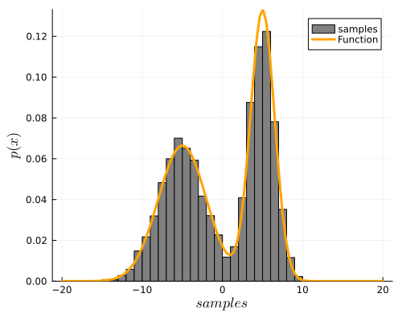
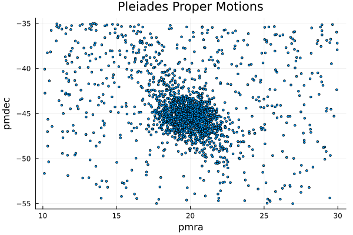

# McmcHermes.jl


*A documentation for the McmcHermes package.*

McmcHermes is a pure-Julia implementation of [Metropolis Hasting Algorithm](https://en.wikipedia.org/wiki/Metropolis–Hastings_algorithm) under an MIT license. McmcHermes will help you if you want to estimate model parameters or sample a probability density distribution.

```@contents
```

## Installation

```julia
using Pkg
Pkg.add("McmcHermes")
```

## Basic Usage

!!! note

    This guide assumes that you already have define your likelihood, prior and the logarithm of the posterior probability as in the example below.


### Sampling

If you want to draw samples from two Gaussian distributions, you would do something like:

```julia
function pdf(X::Number, params::Vector)
    s1, s2, mu1, mu2 = params[1], params[2], params[3], params[4]
    return 1 / (sqrt(2 * pi) * s1) * exp( -0.5*((X - mu1)/s1)^2 ) + 1 / (sqrt(2 * pi) * s2) * exp( -0.5*((X - mu2)/s2)^2 )
end

function gaussian_function(X::Vector, params::Vector)
    x_values = collect(range(minimum(X), maximum(X), length=length(X)))
    s1, s2, mu1, mu2 = params[1], params[2], params[3], params[4]
    return 0.5 ./ (sqrt(2 * pi) .* s1) .* exp.(-0.5*((x_values .- mu1)./s1).^2) .+ 0.5 ./ (sqrt(2 * pi) .* s2) .* exp.(-0.5*((x_values .- mu2)./s2).^2)
end

using McmcHermes

params = [3, 1.5, -5, 5]
interval = [-20, 20]
sampling = McmcHermes.sampler(pdf, 10000, interval, params)

x_values = Vector{Float64}(range(interval[1], interval[2], 100))

histogram(sampling, xlabel=L"samples", ylabel=L"p(x)", xguidefontsize=12, color=:gray, yguidefontsize=12, normalize=:pdf, show=true, label="samples")
plot!(x_values, gaussian_function(x_values, params), lw=3, size=(500,400), label="Function", lc=:orange, show=true)
```




### Parameter estimation

*McmcHermes* can be used to estimate parameters from a model. For instance, from one of my papers [*A Gaia astrometric view of the open clusters, Pleiades, Praesepe, and Blanco 1*](https://ui.adsabs.harvard.edu/abs/2023A%26A...677A.163A/abstract); the estimation of the nine parameters of the assumed proper motions model can be estimated through *McmcHermes*.

The log-likelihood of the proper motions model is defined as

<div class="math">

\[
\log \mathcal{L}(x, y \mid \theta) = \sum \log \left[ 
A_{\text{circ}} \cdot \exp\left( 
-\frac{1}{2} \left( 
\left( \frac{x - \mu_{xc}}{s} \right)^2 + 
\left( \frac{y - \mu_{yc}}{s} \right)^2 
\right) 
\right) + 
A_{\text{elip}} \cdot \exp\left( 
-\frac{1}{2(1 - \rho^2)} \left( 
\left( \frac{x - \mu_{xf}}{s_x} \right)^2 + 
\left( \frac{y - \mu_{yf}}{s_y} \right)^2 - 
2\rho \left( \frac{x - \mu_{xf}}{s_x} \right) 
\left( \frac{y - \mu_{yf}}{s_y} \right) 
\right) 
\right) 
\right]
\]

</div>

with 
<div class="math">

\[
A_{\text{circ}} = \frac{n_c}{2\pi s^2}
\]

\[
A_{\text{elip}} = \frac{1 - n_c}{2\pi s_x s_y \sqrt{1 - \rho^2}}
\]

</div>

That function depends on nine parameters

<div class="math">

\[
n_c,\quad s,\quad s_x,\quad s_y,\quad \rho,\quad \mu_{xc},\quad \mu_{yc},\quad \mu_{xf},\quad \mu_{yf}
\]

</div>

Let's now estimate them by using the *McmcHermes* package. First, here is the plot of the proper motions in the field of the Pleiades open cluster

```julia
using Distributions, Plots, LaTeXStrings, DataFrames, CSV

df = DataFrame(CSV.File("./pleiades_field-result.csv"))
pleiades_field = df[(df.pmra .>= 10) .& (df.pmra .<= 30) .& (df.pmdec .>= -55) .& (df.pmdec .<= -35), :]

x = pleiades_field[!,:pmra]
y = pleiades_field[!,:pmdec]
scatter(x, y, title="Pleiades Proper Motions", xlabel="pmra", ylabel="pmdec", legend=false, markersize=2)
```




You can download the Pleiades field data from the [*Gaia Archive*](https://gea.esac.esa.int/archive/) by using this query
```sql
SELECT * FROM gaiadr3.gaia_source AS gaia 
WHERE CONTAINS(POINT('ICRS',gaia.ra,gaia.dec), CIRCLE('ICRS', 56.85, 23.51, 5))=1
AND gaia.visibility_periods_used > 6 AND gaia.pmra IS NOT NULL AND gaia.pmra != 0 
AND gaia.pmdec IS NOT NULL AND gaia.pmdec != 0 AND gaia.parallax IS NOT NULL AND gaia.ruwe < 1.4
AND gaia.parallax_over_error > 10 AND gaia.astrometric_params_solved > 3
AND gaia.parallax >= 2
```

Now, we define the likelihood and prior

```julia
function log_likelihood(X::Vector, params::Vector)
    x, y = X[1], X[2]
    nc, s, sx, sy, rho = params[1], params[2], params[3], params[4], params[5]
    mu_xc, mu_yc, mu_xf, mu_yf = params[6], params[7], params[8], params[9]
    amp_circ = nc ./ (2 * pi .* s.^2)
    amp_elip = (1-nc) ./ (2 * pi * sx * sy * sqrt(1 - rho.^2))
    Exp_circ = -0.5 * (((x .- mu_xc)./s).^2 .+ ((y .- mu_yc)./s).^2)
    Exp_elip = -1 ./ (2*(1-rho.^2)) .* (((x .- mu_xf)./sx).^2
        .+ ((y .- mu_yf)./sy).^2 .- 2 * rho * ((x .- mu_xf)./sx) .* ((y .- mu_yf)./sy))
    z = amp_circ .* exp.(Exp_circ) + amp_elip .* exp.(Exp_elip)
    return sum(log.(z))
end

function log_prior(params::Vector)
    nc, s, sx, sy, rho = params[1], params[2], params[3], params[4], params[5]
    mu_xc, mu_yc, mu_xf, mu_yf = params[6], params[7], params[8], params[9]
    if 0.0 < nc < 1.0 && 0.0 < s < 10.0 && 0.0 < sx < 10.0 && 0.0 < sy < 10.0 && -1.0 < rho < 1.0
        return 0.0
    end
    return -Inf
end

function log_probability(X::Vector, params::Vector)
    x, y = X[1], X[2]
    lp = log_prior(params)
    if !isfinite(lp)
        return -Inf
    end
    return lp + log_likelihood(X, params)
end
```

First, let's apply the Maximum Likelihood Estimation to get a good initial guess

```julia
using Optim

make_closures(X) = params -> -log_likelihood(X, params)
data = [x, y]
nc, s, sx, sy, rho = 0.5, 1.0, 5.0, 5.0, 0.1
mu_xc, mu_yc, mu_xf, mu_yf = 20, -45, 20, -45
initparams = Vector{Float64}([nc, s, sx, sy, rho, mu_xc, mu_yc, mu_xf, mu_yf])
nll = make_closures(data)
opt_pm = optimize(nll, initparams, NelderMead(), autodiff=:forward)
mle_params = Optim.minimizer(opt_pm)
println("mle_params: ", mle_params) # [0.5703616168913359, 1.145121636314209, 4.683106119784698, 5.1177766210904485, -0.16776744025292578, 19.891677759318622, -45.419917930062915, 19.632955307887066, -43.415932987439774]
```

Then, define the number of walkers, iterations, dimension of the parameter space and the initial guess.
Here we use the initial guess obtained from the MLE.

```julia
using McmcHermes

n_iter, n_walkers = 5000, 50
n_dim = 9
seed = rand(n_walkers, n_dim) * 1e-4 .+ transpose(mle_params)

chains = McmcHermes.run_mcmc(log_probability, data, seed, n_iter, n_walkers, n_dim, a=0.01)

println(size(chains)) # (5000, 50, 9)
```

The convergence of the chains can be validated by the Gelman-Rubin's diagnostic:

```julia 
println("Gelman Rubin Diagnostic: ", McmcHermes.get_gelman_rubin(chains)) # 1.1161957469617692
```

Finally, plot the corner plot with the chains.

```julia
flat_chains = McmcHermes.get_flat_chain(chains, burn_in=100, thin=10)
println(size(flat_chains)) # (24901, 9)

using PairPlots, CairoMakie

labels = Dict(
    :nc     => L"n_c",
    :s      => L"s",
    :sx     => L"s_x",
    :sy     => L"s_y",
    :rho    => L"\rho",
    :mu_xc  => L"\mu_{xc}",
    :mu_yc  => L"\mu_{yc}",
    :mu_xf  => L"\mu_{xf}",
    :mu_yf  => L"\mu_{yf}"
)

parameters = (:nc, :s, :sx, :sy, :rho, :mu_xc, :mu_yc, :mu_xf, :mu_yf)
data = NamedTuple{parameters}(eachcol(flat_chains))
pairplot(data; labels=labels, axis=(xlabelsize=18, ylabelsize=18))
```


*Developed by [J. Alfonso](https://github.com/stevenalfonso).*


```@index
```

```@autodocs
Modules = [McmcHermes]
```