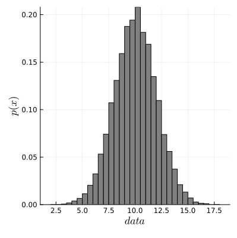

# McmcHermes.jl


*A documentation for the McmcHermes package.*

McmcHermes is a pure-Julia implementation of [Metropolis Hasting Algorithm](https://en.wikipedia.org/wiki/Metropolis–Hastings_algorithm) under an MIT license. McmcHermes will help you if you want to estimate model parameters or sample a probability density distribution.

```@contents
```

## Installation

```julia
using Pkg
Pkg.add("McmcHermes")
```

## Basic Usage

!!! note

    This guide assumes that you already have define your likelihood, prior and the logarithm of the posterior probability as in the example below.


### Sampling

If you want to draw samples from the following distribution:

$P(x) = \frac{1}{\sqrt{2 \pi} \sigma_{1}} e^\left[- \frac{(x - \mu_{1})^{2}}{2 \sigma_{1}^{2}}\right] + \frac{1}{\sqrt{2 \pi} \sigma_{2}} e^\left[- \frac{(x - \mu_{2})^{2}}{2 \sigma_{2}^{2}}\right]$

You would do something like:

```julia
using McmcHermes

function pdf(X::Number, params::Vector)
    s1, s2, mu1, mu2 = params[1], params[2], params[3], params[4]
    return 1 / (sqrt(2 * pi) * s1) * exp( -0.5*((X - mu1)/s1)^2 ) + 1 / (sqrt(2 * pi) * s2) * exp( -0.5*((X - mu2)/s2)^2 )
end

function gaussian_function(X::Vector, params::Vector)
    x_values = collect(range(minimum(X), maximum(X), length=length(X)))
    s1, s2, mu1, mu2 = params[1], params[2], params[3], params[4]
    return 0.5 ./ (sqrt(2 * pi) .* s1) .* exp.(-0.5*((x_values .- mu1)./s1).^2) .+ 0.5 ./ (sqrt(2 * pi) .* s2) .* exp.(-0.5*((x_values .- mu2)./s2).^2)
end

params = [3, 1.5, -5, 5]
interval = [-20, 20]
sampling = McmcHermes.sampler(pdf, 10000, interval, params)

x_values = Vector{Float64}(range(interval[1], interval[2], 100))

histogram(sampling, xlabel=L"samples", ylabel=L"p(x)", xguidefontsize=12, color=:gray, yguidefontsize=12, normalize=:pdf, show=true, label="samples")
plot!(x_values, gaussian_function(x_values, params), lw=3, size=(500,400), label="Function", lc=:orange, show=true)
```


### Parameter estimation

To estimate parameters $\mu$ and $\sigma$ from a gaussian distribution. First, you need some data

```julia
using Distributions, Plots, LaTeXStrings, DataFrames

mu, sigma = 10, 2 # truths
l_b, u_b = 0, 20
d = Truncated(Normal(mu, sigma), l_b, u_b)
N = 1000
data = rand(d, N)

histogram(data, legend=false, size=(300,300), xlabel="data", show=true)
```



Now, define likelihood and prior

```julia
function log_likelihood(X::Vector, parameters::Vector)
    mu, sigma = parameters[1], parameters[2]
    y = 1 ./ (sqrt(2 * pi) .* sigma) .* exp.( -0.5 * ((X .- mu)./sigma).^2 )
    return sum(log.(y))
end

function log_prior(parameters::Vector)
    mu, sigma = parameters[1], parameters[2]
    if 5.0 < mu < 15.0 && 0.0 < sigma < 4.0
        return 0.0
    end
    return -Inf
end

function log_probability(X::Vector, parameters::Vector)
    lp = log_prior(parameters)
    if !isfinite(lp)
        return -Inf
    end
    return lp + log_likelihood(X, parameters)
end
```

Then, define the number of walkers, iterations, dimension of the parameter space and the initial guess.

```julia
using McmcHermes

mu, sigma = 10, 2
initparams = Vector{Float64}([mu, sigma])

n_iter, n_walkers = 5000, 30
n_dim = 2
seed = rand(n_walkers, n_dim) * 1e-4 .+ transpose(initparams)

chains = McmcHermes.run_mcmc(log_probability, data, seed, n_iter, n_walkers, n_dim, a=0.01)

println(size(chains)) # (5000, 30, 2)
```

The convergence of the chains can be validated by the Gelman-Rubin's diagnostic:

```julia 
println("Gelman Rubin Diagnostic: ", McmcHermes.get_gelman_rubin(chains)) # 1.0206366055
```

Finally, plot the chains.

```julia
labels = Tuple([L"\mu", L"\sigma"])
x = 1:size(chains)[1]
p = []
for ind in 1:n_dim
    push!(p, plot(x, [chains[:,i,ind] for i in 1:size(chains)[2]], legend=false, 
    lc=:black, lw=1, ylabel=labels[ind], alpha = 0.1, xticks=false))
end

plot(p[1], p[2], layout = (2,1))
plot!(size=(600,200), xlims = (0, size(chains)[1]), show=true)
```


Chains can also be plotted in a corner. To do so, get the flat chain

```julia
flat_chains = McmcHermes.get_flat_chain(chains, burn_in=100, thin=10)
println(size(flat_chains)) # (14901, 2)
mean_posterior = quantile(flat_chains[:, 1], 0.5) # 10.0273672
std_posterior = quantile(flat_chains[:, 2], 0.5) # 1.9998453

using PairPlots, CairoMakie

table = (; x=flat_chains[:,1], y=flat_chains[:,2],)
fig = pairplot(table, labels = Dict(:x => L"\mu", :y => L"\sigma"))
```


*Develop by [J. Alfonso](https://github.com/stevenalfonso).*


```@index
```

```@autodocs
Modules = [McmcHermes]
```