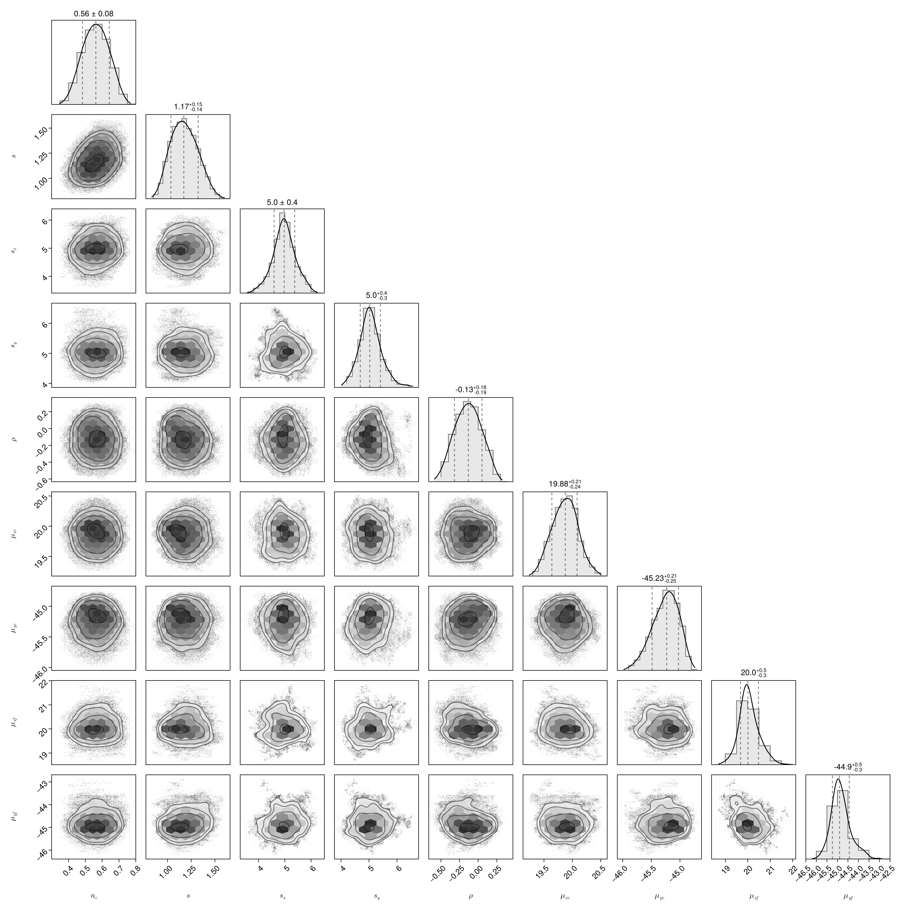

# McmcHermes.jl


*A documentation for the McmcHermes package.*


McmcHermes provides a simple but efficient way to generate [Markov Chain Monte-Carlo](https://en.wikipedia.org/wiki/Markov_chain_Monte_Carlo) algorithms in order to sample a probability density distribution.

```@contents
```

## Overview

The major functions in this module are:


run\_mcmc: run multiple chains with a specific number of walkers.

get\_flat\_chain: get the stored chain of MCMC samples.

get\_gelman\_rubin: get the Gelman Rubin convergence diagnostic of the chains. 


!!! note

    This guide assumes that you already have define your likelihood, prior and the logarithm of the posterior probability as in the example below.


## Pkg Registry

```julia
using Pkg
Pkg.add("McmcHermes")
```

## Example

First, let's generate some data:

```julia
using Distributions, Plots, LaTeXStrings, DataFrames, ProgressMeter

mu, sigma = 10, 2
l_b, u_b = 0, 20
d = Truncated(Normal(mu, sigma), l_b, u_b)
N = 1000
data = rand(d, N)

histogram(data, legend=false, size=(300,300), xlabel="data", show=true)
```


In order to sample the posterior probability distribution, it is necessary to define the likelihood, prior and logarithm of the posterior probability.


```julia
function log_likelihood(X::Vector, parameters::Vector)
    mu, sigma = parameters[1], parameters[2]
    y = 1 ./ (sqrt(2 * pi) .* sigma) .* exp.( -0.5 * ((X .- mu)./sigma).^2 )
    return sum(log.(y))
end

function log_prior(parameters::Vector)
    mu, sigma = parameters[1], parameters[2]
    if 5.0 < mu < 15.0 && 0.0 < sigma < 4.0
        return 0.0
    end
    return -Inf
end

function log_probability(X::Vector, parameters::Vector)
    lp = log_prior(parameters)
    if !isfinite(lp)
        return -Inf
    end
    return lp + log_likelihood(X, parameters)
end
```

Call the McmcHermes package and define the number of walkers, iterations, dimension of the parameter space and the initial guess.


```julia
using McmcHermes

mu, sigma = 10, 2
initparams = Vector{Float64}([mu, sigma])

n_iter, n_walkers = 1000, 200
n_dim, a = 2, 0.01

chain_tests = run_mcmc(log_probability, data, initparams, n_iter, n_walkers, n_dim, a=a)
println(size(chain_tests))
```
(1000, 100, 2)


Gelman-Rubin's diagnostic can be obtained from the chains calling the get\_gelman\_rubin method.


```julia 
println("Gelman Rubin Diagnostic: ", get_gelman_rubin(chain_tests))
```
Gelman Rubin Diagnostic: 1.0206366055763267


Finally, plot the chains.


```julia
labels = Tuple([L"\mu", L"\sigma"])
x = 1:size(chain_tests)[1]
p = []
for ind in 1:n_dim
    push!(p, plot(x, [chain_tests[:,i,ind] for i in 1:size(chain_tests)[2]], legend=false, 
    lc=:black, lw=1, ylabel=labels[ind], alpha = 0.1, xticks=false))
end

plot(p[1], p[2], layout = (2,1))
plot!(size=(600,200), xlims = (0, size(chain_tests)[1]), show=true)
```


```julia
flat_chains = get_flat_chain(chain_tests, burn_in=100, thin=10)

flat = DataFrame(flat_chains, :auto)
colnames = ["mu", "sigma"]
flat = rename!(flat, Symbol.(colnames))

using PairPlots, CairoMakie
pairplot(flat)
```



*Develop by [Steven Alfonso](https://github.com/stevenalfonso).*


```@index
```

```@autodocs
Modules = [McmcHermes]
```